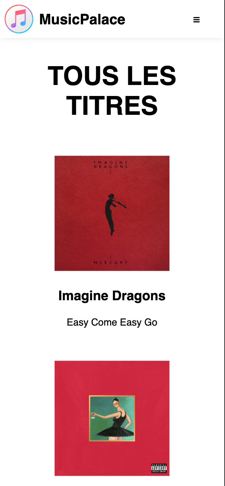
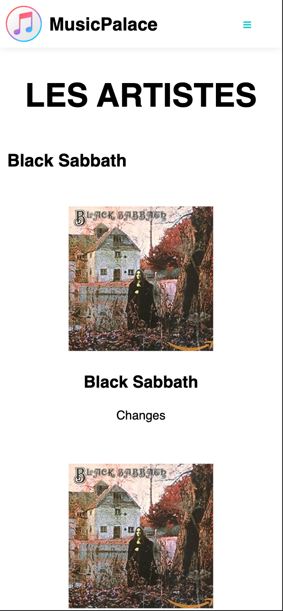
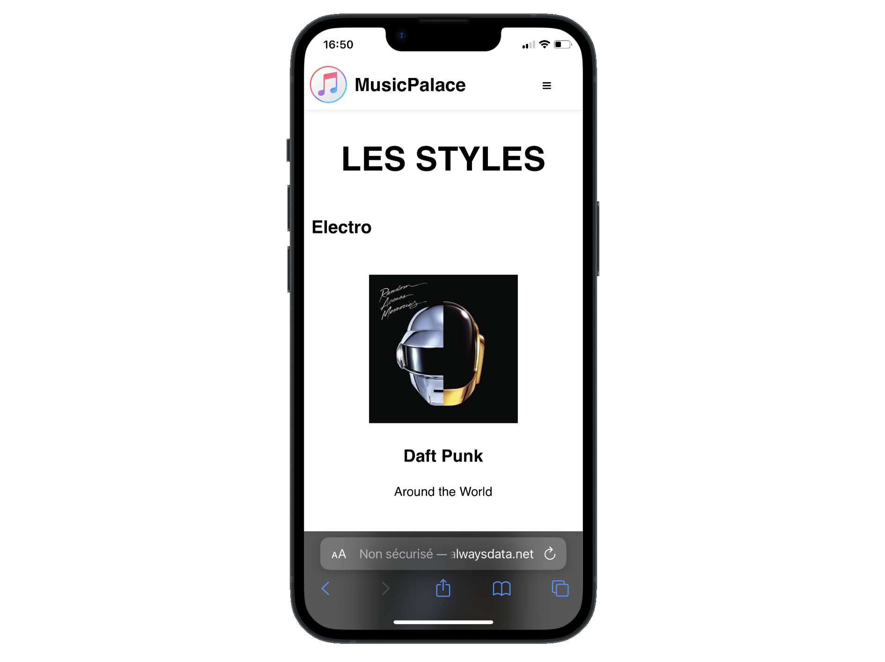
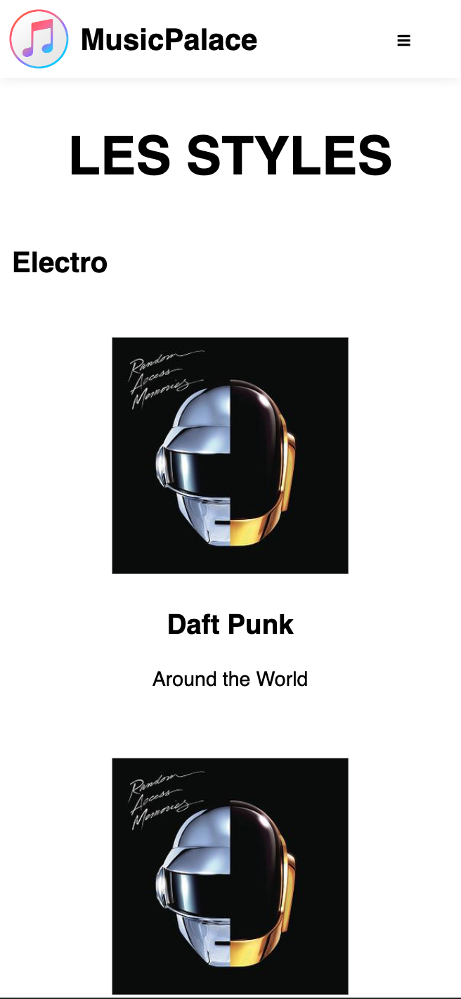
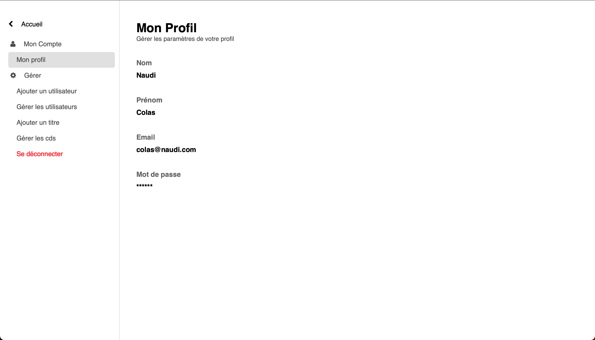
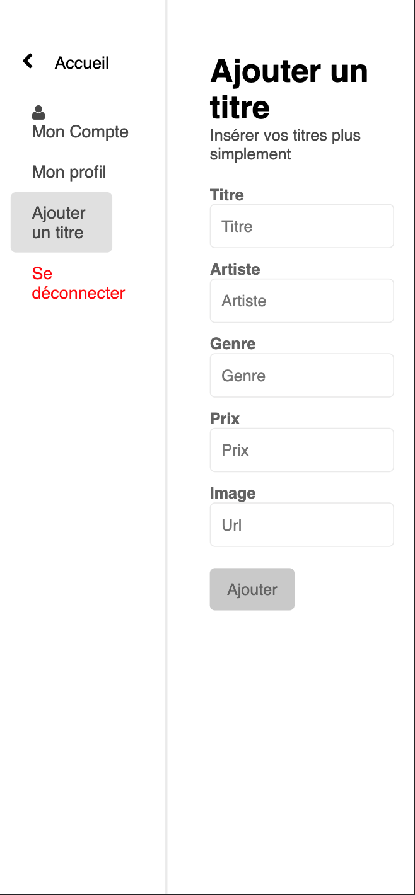

    
    <h1>MusicPalace</h1>

## Lien du site
http://cnaudi.alwaysdata.net

## À propos
MusicPalace est une application __web responsive__ de vente de cd.
Elle permet de consulter les albums disponibles, de les ajouter au panier, de les acheter.
Les cds peuvent être classés par genre et par artiste.
L'administrateur peut ajouter des cds directement depuis l'interface d'administration qui n'est __accessible qu'avec un compte admin__.

    <h2>ATTENTION</h2>
    
Le site est hébergé sur un serveur gratuit, il peut donc être lent et ne pas fonctionner correctement.

## Langages et outils utilisés
- HTML
- CSS
- JavaScript
- PHP
- MySQL
---
- Git
- PhpStorm
- AlwaysData

## Aperçu

    <h2>Home</h2>
    
    <h2>Home Mobile</h2>
    
    <h2>Artistes</h2>
    
    <h2>Artistes Mobile</h2>
    
    <h2>Styles</h2>
    
    <h2>Styles Mobile</h2>
    
    <h2>Parametres</h2>
    
    <h2>Parametres Mobile</h2>
    

