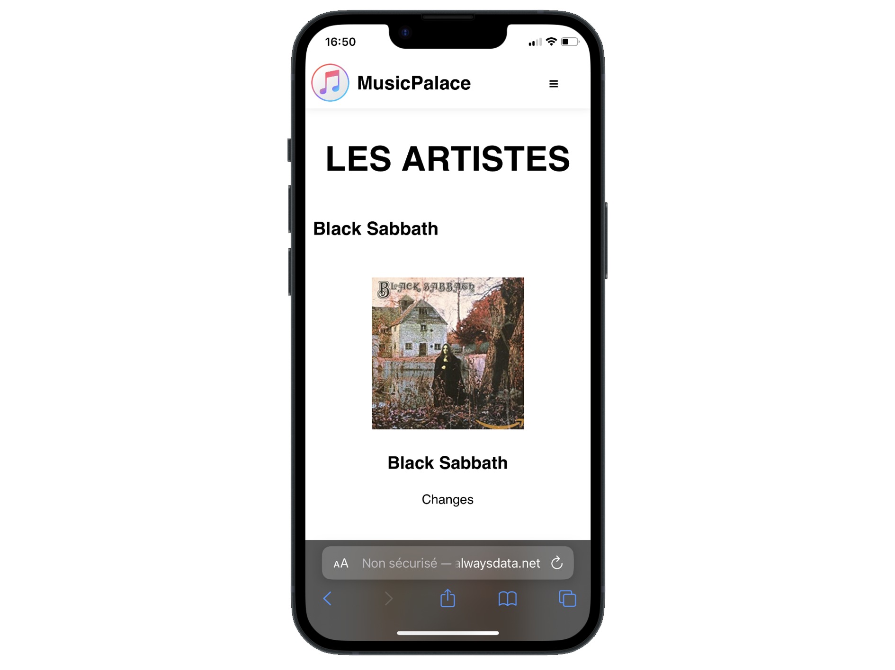
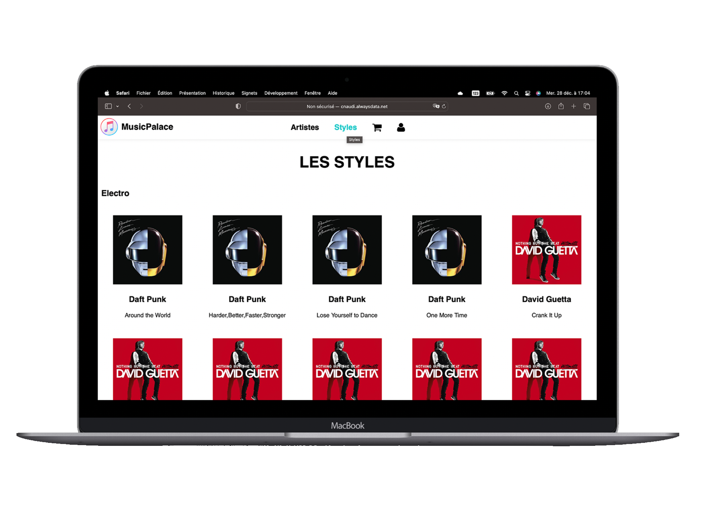

    
    <h1>MusicPalace</h1>

## Link
http://cnaudi.alwaysdata.net

## About
MusicPalace est une application __web responsive__ de vente de cd.
Elle permet de consulter les albums disponibles, de les ajouter au panier et de les acheter.
Les cds peuvent être classés par genre et par artiste.
L'administrateur peut gérer(ajouter, modifier, supprimer) des cds et des utilisateurs directement depuis l'interface d'administration qui n'est __accessible qu'avec un compte admin__.

MusicPalace is a __web responsive__ application for selling cds.
It allows you to view the available albums, add them to the cart and buy them.
The cds can be sorted by genre and by artist.
The administrator can manage(add, modify, delete) cds and users directly from the administration interface which is __only accessible with an admin account__.

    <h2>Warning</h2>
    
Don't put a password you use on other website because it is in clear in the database.

    
N'utiliser pas un mot de passe que vous utilisez autre part car il est en clair dans la base de données.

## Languages et Tools
- HTML
- CSS
- JavaScript
- PHP
- SQL
---
- Git
- PhpStorm
- AlwaysData

## Preview

    <h2>Connexion</h2>
    
    <h2>Connexion Mobile</h2>
    
    <h2>Home</h2>
    
    <h2>Home Mobile</h2>
    
    <h2>Artists</h2>
    
    <h2>Artists Mobile</h2>
    
    <h2>Styles</h2>
    
    <h2>Styles Mobile</h2>
    
    <h2>Cart</h2>
    
    <h2>Cart Mobile</h2>
    
    <h2>Settings</h2>
    
    <h2>Settings Mobile</h2>
    

